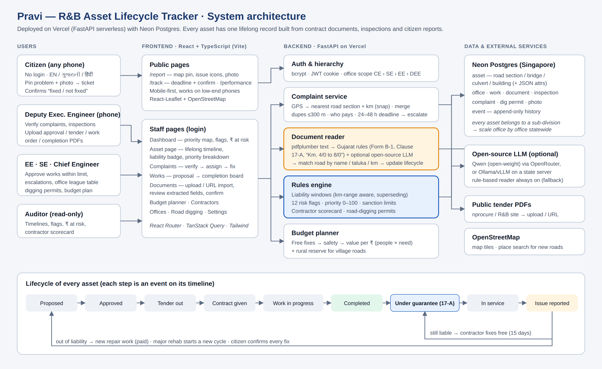

# Pravi — R&B Asset Lifecycle Tracker (Gujarat)

**Every public asset, one lifelong record.** Pravi tracks the roads, bridges, culverts and government buildings of Gujarat's Roads & Buildings (R&B) department across their whole life: proposal → sanction → tender → award → construction → completion → **defect liability** → service → complaints → repair.

It builds the inventory from paperwork R&B already produces (tender notices, work orders and completion certificates) and adds engineer inspections and citizen reports. From that data it answers three questions:

1. **Who must pay for this repair?** If a contractor is still inside the Defects Liability Period (Form B-1, Clause 17-A), the fix costs the department ₹0.
2. **What should we fix first?** A transparent 0–100 priority score, plus 12 risk flags.
3. **Where does each rupee do the most good?** A budget planner that funds free fixes first, then safety, then value per rupee, with a reserved share for village roads.

> Built for the **"Build for Billions"** hackathon. Demo district: **Vadodara**. All contractor names, figures and road codes in the demo data are fictional.

---

## Live demo & logins

Logins follow the real R&B chain of command. Each officer sees their own office and everything below it.

| Role (office) | Username | Password | Sees / can do |
|---|---|---|---|
| Chief Engineer (State R&B wing) | `ce_state` | `Chief@123` | Whole wing; approves works above ₹2 crore; complaints late 7× escalate here |
| Superintending Engineer (Vadodara Circle) | `se_vadodara` | `Super@123` | All divisions in the circle; approves works up to ₹2 crore |
| Executive Engineer (Vadodara Division) | `ee_vadodara` | `Exec@123` | Whole division; approves works up to ₹50 lakh, road-digging permits, budget plan, settings, reset demo |
| Deputy Executive Engineer (Vadodara Sub-division) | `de_vadodara` | `Engineer@123` | Talukas Vadodara, Waghodia, Savli, Desar; complaints, inspections, documents; approves works up to ₹5 lakh |
| Deputy Executive Engineer (Padra Sub-division) | `de_padra` | `Engineer@123` | Talukas Padra, Karjan, Sinor |
| Deputy Executive Engineer (Dabhoi Sub-division) | `de_dabhoi` | `Engineer@123` | Taluka Dabhoi |
| Auditor (Vadodara Division) | `auditor_vadodara` | `Audit@123` | View only |
| Citizen | *no login* | — | `/report` to report a problem, `/track` to follow a ticket, `/performance` for the public scorecard |

- Deployed URL: **`<add your production Vercel URL here>`**
- The first request after a quiet period can take a few seconds while the server starts.
- **Settings → Reset demo data** restores the original demo state.

> **Submission documents:** [Notes for judges](docs/NOTES_FOR_JUDGES.md) · [Assumptions](docs/ASSUMPTIONS.md) · [Architecture diagram](docs/architecture.png) · [Setup & demo guide](DEMO_GUIDE.md)

### 5-minute demo path
1. **Dashboard:** the priority map, "Fix first" list, red flags and ₹ at risk.
2. **Documents → Try `1_tender_…special_repair.pdf`:** the fields are read, Vadodara–Waghodia Road km 4–8 is matched, and a **liability warning** appears before anything is saved. Confirming it raises a red flag.
3. **Citizen app `/report`** (on a phone): pin a pothole on Vadodara–Waghodia Road. The ticket says the contractor must repair it free.
4. **Complaints:** verify, assign to the liable contractor, and a **defect notice** (Clause 17-A, 15 days) opens. Mark it fixed, and the citizen confirms on `/track`.
5. **Asset page:** one road's lifelong timeline, its liability badge and its priority breakdown.
6. **Budget planner:** a ₹10 crore budget split into free fixes, blocked payments, funded works and deferred works.
7. **Hierarchy:** log in as `se_vadodara` → **Offices** compares sub-divisions; the **Viewing** box switches office; late complaints show who they escalated to.
8. **Road digging:** a gas company dug a road still under guarantee — the complaint there goes to the utility, not the contractor.

---

## Tech stack

| Layer | Technology |
|---|---|
| Frontend | **React 19 + TypeScript**, Vite, React Router, TanStack Query, Tailwind CSS, React-Leaflet (OpenStreetMap), lucide-react icons |
| Backend | **FastAPI** (Python 3.11), SQLModel / SQLAlchemy, Pydantic, Uvicorn |
| Auth | JWT (PyJWT) in an httpOnly cookie, bcrypt password hashing, role- and office-based access (CE / SE / EE / Deputy EE / Auditor) |
| Database | **PostgreSQL** (Neon) in deployment; SQLite for local development |
| Documents | pdfplumber + a rule-based reader for Gujarat R&B formats; optional **open-source LLM** (Qwen via OpenRouter, or Ollama / vLLM) |
| Deploy | **Vercel** (FastAPI serverless) + **Neon** Postgres; a Docker image for a state data centre is also included |

## System architecture



- **One FastAPI service** serves the web pages and the REST API. API docs are at `/docs`.
- **Database:** Postgres (Neon) in deployment, SQLite locally. Every row carries its `district`, so the data can be partitioned by district to scale statewide.
- **Frontend:** React + TypeScript (Vite) single-page app, served by FastAPI after `npm run build`. It's mobile-first for field staff and citizens.
- **Auth:** bcrypt password hashes and a JWT in an httpOnly cookie. Every user belongs to an **office** (wing → circle → division → sub-division); every asset belongs to a sub-division. Staff queries are filtered to the office subtree the user is allowed to see.
- **Document reader:** a rule-based reader tuned to Gujarat R&B formats, plus an **optional open-source LLM** (Qwen via OpenRouter, or Ollama/vLLM on a government server).

---

## What we track, and why

| Asset | Tracked as | Maintenance trigger | Why it matters |
|---|---|---|---|
| Road sections (SH, MDR, ODR, village) | road + **km range** | age + condition | Most R&B spending; what citizens feel daily |
| Bridges | one record, pinned to road km | pre/post-monsoon inspection | Rare but catastrophic failures |
| Culverts & drains | point on a road | pre-monsoon cleaning | Water is the #1 cause of road failure |
| Government buildings | one record | structural audit every 5 yrs (>15 yrs old) | Hospitals and schools: safety |

For every asset we keep five things:
- **Identity:** code, location, category, age, traffic or users.
- **Works:** every contract, with contractor, cost and liability period.
- **Inspections:** condition 1–5, cleaning and structural audits.
- **Citizen complaints.**
- **An append-only event history.**

### Liability (the money-saving lever)
- **Where the data comes from:** the tender gives the liability period, the work order gives the contractor and cost, and the completion certificate gives the date the clock starts.
- **The rule:** for any **road + km** on any date, the latest completed work covering that spot decides. If its window is still open, that contractor is liable. Matching uses **km ranges, not road names**, and a newer work over the same stretch replaces the older liability.
- **Actions:**
  - A complaint inside the window generates a defect notice to the contractor (₹0).
  - A paid repair tender inside the window raises a 🔴 flag with ₹ at risk.
  - A window ending within 60 days raises "inspect before it expires".

### Priority score (0–100, weights editable by the EE)
`score = 100 × (0.30·condition + 0.25·criticality + 0.20·complaints + 0.15·age + 0.10·repeat repairs)`

- **Overrides:** a bridge rated 1/5, or a bridge inspection more than 12 months old, is marked **Urgent**.
- **Bands:** this week / this month / next season / monitor.
- **Liability** never changes urgency, only **who pays**.

### Risk flags
1. Paid repair while the contractor is liable
2. Widening/new work during liability, which needs review
3. Repeat failure (3+ repairs in 12 months)
4. Contractor ignoring a defect notice (>14 days)
5. Stale complaint
6. Delayed work
7. Liability ending within 60 days
8. Bridge inspection overdue, or a poor rating with no action
9. Culvert missed pre-monsoon cleaning
10. Structural audit overdue

The dashboard also marks roads with no renewal in 7+ years as ageing assets.

11. Structural safety class C1 / C2A / C2B without action (Mumbai-style audit classes)
12. Road dug by a utility and not restored

## R&B hierarchy in Pravi

Gujarat R&B works through a chain of offices: **Secretary → Chief Engineer (wing: State, Panchayat, NH …) → Superintending Engineer (circle, 3–5 divisions) → Executive Engineer (division, about a district) → Deputy Executive Engineer (sub-division, one or more talukas) → Additional Assistant Engineer (section, field staff).**

- **Scope:** each login sees its own office and everything below it. Senior officers can switch the **Viewing** office to look inside one unit.
- **Offices page:** a league table of the units under you — open and late complaints, on-time repairs, drains cleaned, works waiting for approval, ₹ at risk.
- **Approval by cost (technical sanction):** a proposed work goes to the lowest officer whose limit covers it — Deputy EE ≤ ₹5 lakh, EE ≤ ₹50 lakh, SE ≤ ₹2 crore, CE above (illustrative limits in `app/org.py`).
- **Escalation:** every complaint has a repair deadline (potholes and waterlogging 48 h, 24 h in the monsoon; broken railings 24 h; others 7 days). Late → Executive Engineer; 3× late → Superintending Engineer; 7× late → Chief Engineer.
- New assets created from documents are attached to the sub-division that covers their taluka.

## Ideas taken from Mumbai (BMC)

| Mumbai practice | In Pravi |
|---|---|
| Pothole complaints fixed within 24 h in the monsoon; Bombay HC (2025) set 48 h as the limit | Repair deadline on every complaint, shown to staff and citizens, with automatic escalation |
| Roads under defect liability repaired by the contractor at no cost | Already core to Pravi (Clause 17-A) |
| Trenching policy: utilities need permission, new roads can't be dug in their first year | **Road digging** page: permits, first-year and monsoon blocks, restoration charge, utility liable for 1 year; complaints at a dug spot go to the utility |
| Nullah desilting proven with photos/video, tracked publicly | Culvert cleaning must carry a photo; drains cleaned before monsoon shown per sub-division |
| Structural audit classes C1 / C2A / C2B / C3 | Recorded on building and bridge audits; C1/C2A make the asset Urgent |
| Public ward-wise progress | Public **/performance** scorecard per sub-division |
| Geo-tagged proof of repair | "Mark as repaired" needs an after photo; the phone's location is compared with the reported spot |

### Budget planner
1. **Free fixes:** defects under liability go to the contractor at ₹0.
2. **Blocked payments:** paid works on stretches still under liability are held.
3. **Safety first:** urgent bridges and critical buildings are funded first.
4. **Value per rupee:** `daily users × need × criticality × length × early-action bonus ÷ cost`.
5. **Rural reserve** (default 25%): village and ODR roads are ranked separately so they aren't always last.

Unit rates and multipliers are illustrative and editable in `app/planner.py`.

---

## Reading Gujarat R&B documents

The reader was built and tested against wording from **real public Gujarat documents**. See `tests/test_extraction.py` for the sources and quotes.

- **Form B-1** "Percentage Rate Tender and Contract for Works": its *Memorandum of works in brief* covers name of work, estimated cost ("Rs. 2,61,39,631.52") and time allowed for completion ("75 (Seventy Five) Days").
- **Clause 17-A** defect liability: *"The Defects Liability period shall be 18 months from the certified date of completion…"*, with defects to be fixed *"within 15 days of receipt of the notice"*.
- **Gujarat chainage:** "Km. 0/0 to 3/150" means km 0.000–3.150.
- **Real tender titles**, for example: *"Resurfacing of Various Roads under Scsp / Mmgsy / Bk / 2026-27 / Package No. 13, Ta. Deesa, (1) Athamanovas to Umedpura Road, Km. 0/0 to 3/150"*. The reader extracts the scheme, package, taluka, road name and km range.
- **Road matching:** real tenders have no road codes, so Pravi matches by **road name words + taluka**, then picks the section by **km**.

**How documents get in:**
- Upload a PDF.
- Or paste a link to a public PDF (**Documents → Import**). URL import works from the deployed server; some portals block automated downloads, in which case download the PDF and upload it.
- The engineer reviews every field before saving. A live preview shows the effect and any **liability warning**.
- `sample_docs/` holds 4 synthetic PDFs in the real Form B-1 layout for the demo (regenerate with `python scripts/make_sample_docs.py`).

### Following a real tender through its lifecycle
1. **Get a real PDF.** Download a tender notice for any Gujarat R&B work (nprocure / R&B website), or paste its link into **Documents → Import**.
2. **Review.** If the road or building is not in the inventory yet, choose **"+ Create new asset from this document"**. Pravi registers it using the road name, km range and taluka, and places it on the map at the taluka (OpenStreetMap geocoding).
3. **Confirm.** A work is created at stage **Tendered**.
4. **Upload later documents with the same Tender ID.** A work order / award notice moves it to **Awarded**, and a completion certificate moves it to **Completed** and starts the defect-liability clock. Each one matches by Tender ID automatically.
5. **If a document isn't public** (completion certificates usually aren't), move the work forward on the **Works** board instead.

### Open-source LLM (optional)
The rule-based reader always runs. To add an LLM:

| Option | Settings |
|---|---|
| **Qwen via OpenRouter** | `OPENROUTER_API_KEY=sk-or-…` (optional `LLM_MODEL=qwen/qwen3.6-27b`; check current names at openrouter.ai/qwen) |
| **Local / state server** (Ollama, vLLM) | `LLM_BASE_URL=http://localhost:11434/v1`, `LLM_MODEL=qwen2.5:7b-instruct` |
| Claude API | `ANTHROPIC_API_KEY=…` |

**Settings → Test LLM** checks the connection. If the model fails, Pravi falls back to the rules automatically. For production, an open model on a state data-centre server keeps documents in India.

---

## Run locally

**Quick start (Python only).** The built React app is already in `frontend/dist`.
- **Windows:** double-click `run.bat`
- **macOS/Linux:** `./run.sh`

Then open http://localhost:8000. The database (`pravi.db`) is created and seeded on first start. Copy `.env.example` to `.env` to set keys.

**Frontend development (hot reload).** Run the backend on port 8000 (as above), then:
```bash
cd frontend
npm install
npm run dev        # http://localhost:5173, proxies /api to :8000
npm run build      # rebuilds frontend/dist, which FastAPI serves
```

**Docker:** `docker build -t pravi . && docker run -p 8000:8000 pravi`

**Tests:** `python tests/test_extraction.py`

## Deploy on Vercel + Neon (free, no card)
1. Push this folder to GitHub (`.env` and `*.db` are git-ignored).
2. On [vercel.com](https://vercel.com), sign in with GitHub, then **Add New → Project** → import the repo. Vercel detects **FastAPI** (`app/main.py`). The built React app in `frontend/dist` is served by FastAPI, so no Node build is needed.
3. Under **Environment Variables**, add:
   - `DATABASE_URL`: the Neon **pooled** connection string. It is required on Vercel, because the server can't keep a local file.
   - `JWT_SECRET`: any long random text.
   - Optional: `OPENROUTER_API_KEY` and `LLM_MODEL`.
4. Click **Deploy**. `vercel.json` gives each request up to 60 s, enough for LLM reading.

Limits on Vercel: uploads must be under about 4.5 MB (photos are compressed in the browser first; tender PDFs are usually small).

## Upgrading an existing database
Start the new version against the same `DATABASE_URL`. On startup Pravi adds any missing columns and creates the office tree, the extra logins and the office of every asset automatically — existing data is kept. (Settings → Reset demo data gives a fresh demo instead.)

## Deploy (Render + Neon, alternative)
1. **Database:** create a free Postgres at [neon.tech](https://neon.tech) and copy the connection string.
2. **Code:** push this folder to GitHub (`.env` and `*.db` are git-ignored).
3. **Service:** on [render.com](https://render.com), choose **New → Blueprint** and pick the repo. `render.yaml` builds the Dockerfile: it compiles the React app, then runs FastAPI.
4. **Environment:** set `DATABASE_URL` to the Neon string, plus `OPENROUTER_API_KEY` if you want the LLM. `JWT_SECRET` is generated automatically.
5. **Check:** open the URL and test the logins.

The same Docker image runs on any container host, including a state data-centre server.

---

## Assumptions
1. Scope is **Gujarat R&B**, demo district **Vadodara**. Roads are covered in depth; bridges, culverts and buildings more lightly.
2. Contract terms follow **Form B-1**; the defect liability period comes from Clause 17-A or the tender.
3. Road geometry is hand-traced and approximate. Road codes (SH-VP etc.), contractors and all figures are **fictional demo data**.
4. Tender and award notices are public. Completion certificates, bills and complaints are simulated because they are internal. In production the tool runs **inside the department** with official access.
5. If the completion date is missing, it is estimated as the award date plus the time limit, and marked *estimated*.
6. Flags are **leads for human review**, not proof of wrongdoing.
7. Priority weights and planner unit rates are illustrative and configurable.
8. The citizen app covers English, Gujarati and Hindi; staff screens are in English for now.
9. Demo logins stand in for government SSO in production.
10. Scanned PDFs without a text layer need OCR (roadmap).
11. The office tree has one onboarded division (Vadodara) with three sub-divisions; other circles/divisions are shown as "not on Pravi yet". Only the State R&B wing is modelled in the data. Sanction limits and escalation steps are illustrative and configurable.
12. Traffic figures (PCU/day) for demo roads are illustrative; roads created from documents default to 1,000 PCU/day. In production they come from R&B's traffic census.

## Questions we asked (and answers)
> *Fill in during the hackathon*
- What does "infrastructure" mean here? → R&B assets: roads, bridges, buildings (Gujarat).
- Track everything or only what needs maintenance? → Everything at base level; the system prioritises.
- What hierarchy does R&B work in? → CE (wing) → SE (circle) → EE (division) → Deputy EE (sub-division) → AAE (section); built into logins, approvals and escalation.
- Why drainage together with roads, bridges and buildings? → Water is the main cause of road failure; culverts and drains are part of the road asset and R&B's monsoon job.
- …

## Project structure
```
app/
  main.py         routes: pages, auth, citizen, complaints, works, documents, planner, settings
  models.py       tables: office, user, asset, work, document, inspection, complaint, dig permit, photo, event, setting
  org.py          R&B hierarchy: offices, scope, sanction limits, complaint deadlines and escalation
  rules.py        liability windows, flags, priority score, contractor scorecard
  planner.py      budget planner
  extraction.py   PDF → fields (Gujarat rules + optional open-source LLM)
  geo.py          snapping GPS to road sections, km along a road
  auth.py         bcrypt + JWT cookie + roles
  seed.py         Vadodara demo data (dates relative to today)
frontend/         React + TypeScript app (Vite)
  src/pages/      Landing, Report (citizen), Track, Login, Dashboard, Assets, AssetDetail,
                  Complaints, Works, Documents, Planner, Contractors, Settings
  src/components/ StaffLayout (nav + auth guard), AssetMap (React-Leaflet), shared UI
  src/lib/        API client, types, formatting, citizen translations (EN / GU / HI)
  dist/           production build served by FastAPI
sample_docs/      demo PDFs in Gujarat Form B-1 layout
docs/             architecture diagram
tests/            extraction tests on real Gujarat document wording
```

## Roadmap
- OCR for scanned PDFs, and Gujarati-only documents via LLM
- Offline-first field app with sync; WhatsApp and voice complaint intake
- GIS import of the full road network (R&B / Bhuvan) and auto-geocoding of tender locations
- Integration with nprocure (tenders), IFMS (payments) and government SSO
- Learn priority weights from real failure data; predictive maintenance
